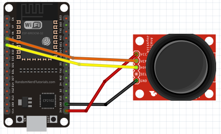
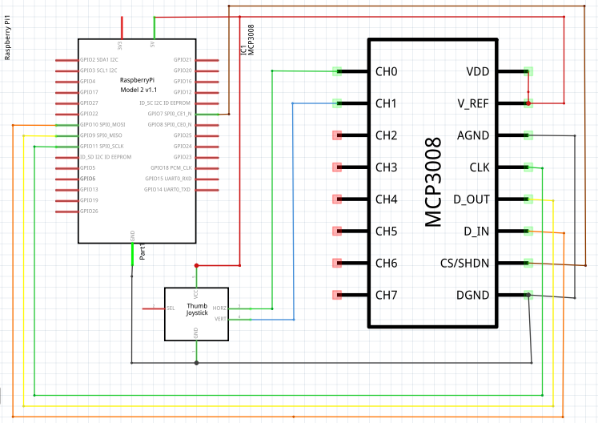

# Compare Performance of Analog Joystick with Raspberry Pi 3A+/0 (+MCP3008) vs ESP32

For the controller portion of a motorized buggy I was using an analog joystick. First attempt was with a Raspberry Pi 0 and ADC (MCP3008). While the Pi0/MCP3008 did work the response was too laggy to be useable. I then tried a Pi3A+ (quad core) and it worked much better with the joystick. Next I used a ESP32 and got the best performance. It is easy to research how a microcontroller (ESP32) would be faster than a Raspberry Pi/ADC (MCP3008) combo in an analog use case. But I wanted to be able to quantify the difference I was seeing between hardware. Boxplots are a great way to visualize how significant the delta is so the exercise also gave me an opportunity to use Jupyter Notebook and learn how to create boxplots with Panda/Seaborn.​ First, to create the dataset, I would need to isolate the bottle neck in the program.  cProfile would be used for the Raspberry Pi Python programs and utime.ticks_diff() would be used to investigate the ESP32 micropython code.​​​

## Connections

## Using cProfile to analyze python code